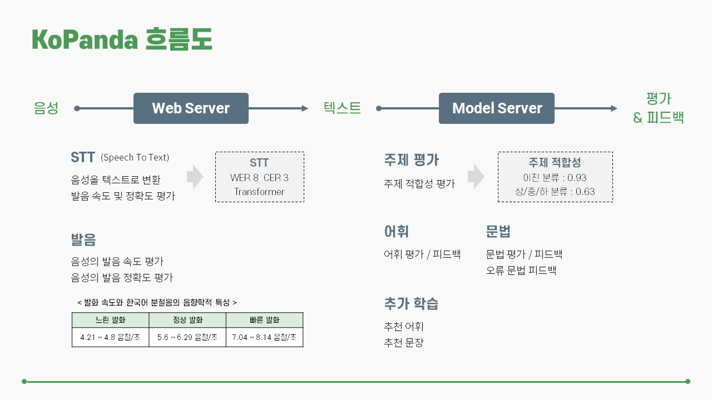
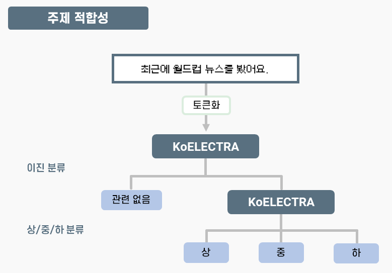
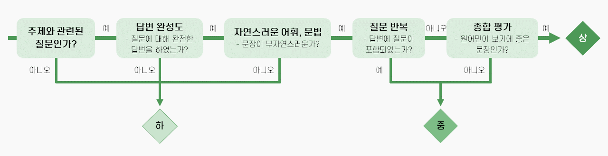
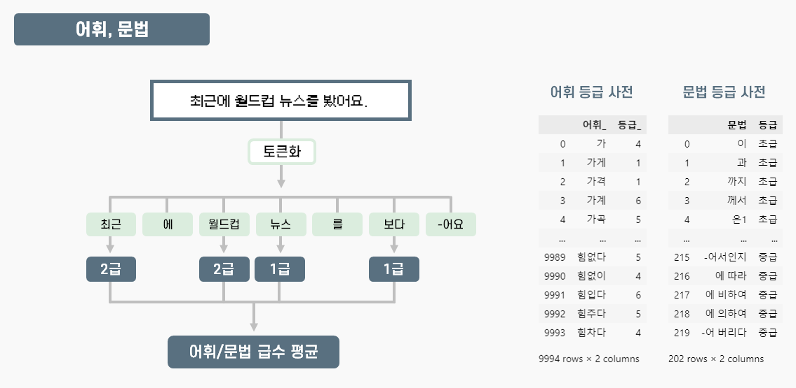
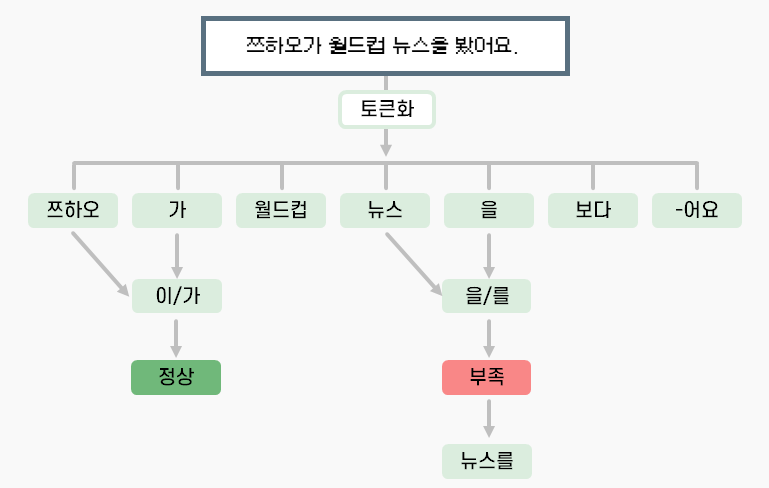
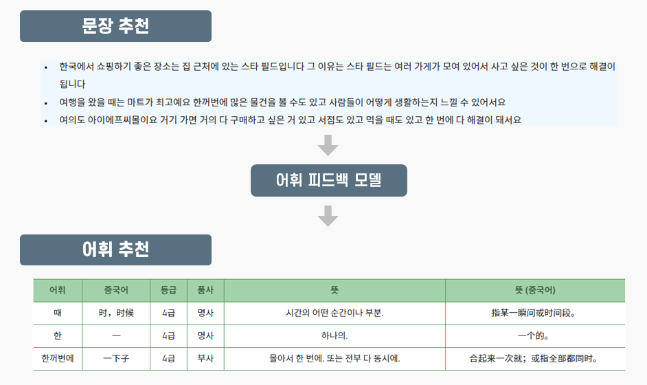

<br>
<p align = "center">
    <a href="https://serulean.github.io/KoPanda/"><a>
</p>

<br>

## 한국어 말하기 능력 시험(TOPIK 말하기 시험) AI 학습 도우미

### 사이트 시연

https://serulean.github.io/KoPanda/

### 주의사항

```
이 사이트는 프로젝트 설명을 위한 것으로, 정식 배포된 서비스가 아닙니다.
```

- PC 환경에 최적화되어 있습니다.

- 녹음, 회원가입 등 몇몇 기능이 작동하지 않습니다.

- 회원가입 및 로그인 없이 이용 가능합니다.

- 소개 편의를 위해 미리 녹음된 음성 및 예시 문장과 결과를 사용하였습니다.

<br>

## 소개 자료

<a href="https://youtu.be/ggfLHrbUwkQ?si=VdCOg34h7Dpce0Py" style="color: green; font-weight: bold">KoPanda 시연 영상</a>

<a href='./assets/KoPanda_발표자료.pdf' style="color: green; font-weight: bold">KoPanda 발표 자료</a>

<br>

## KoPanda 흐름도



<br>

## KoPanda 구성


### 0. 말하기 모의 시험 환경 제공

TOPIK 말하기 시험을 미리 경험할 수 있는 환경을 제공합니다.

<br>

### 1. 음성 → 텍스트

- STT (Speech To Text)
    - Transformer 기반인 OpenAI의 Whisper를 이용했습니다.
    - Whisper의 2가지 모델(Large 모델과 fine tuning한 Small 모델)을 활용했습니다.
    - WER 8, CER 3의 준수한 성능을 보였습니다.

<br>

### 2. 평가 & 피드백 모델

```
TOPIK 말하기 시험을 평가 기준을 바탕으로 기준을 세웠습니다.
```

**1. 언어 평가 모델**

- 발음
    - 속도 : 한국음향학회 논문을 바탕으로 기준을 세워 '느림/정상/빠름' 3가지로 분류합니다.
    - 정확도 : 정답 문장과 전사된 텍스트 결과를 비교하여 정확도를 측정합니다.

- 주제 적합성

    <p align = "center">
    
    </p>

    - 주어진 문장 텍스트를 토큰화한 뒤, 훈련시킨 KoELECTRA 모델을 이용해 분석합니다.

    - 1차로 '관련 있음/없음'으로 이진 분류를 진행하고, '관련 있음'으로 분류된 문장에 대해 2차로 주제와 관련성이 높은지를 '상/중/하' 3가지로 분류합니다.

        <p align = "center">
        
        </p>
    
    - KoGPT와 ChatGPT로 문장을 생성하고, 일정한 기준을 세워 직접 문장들을 라벨링하여 훈련 데이터를 준비해 모델을 훈련시켰습니다. 이진 분류는 정확도 0.92~0.93을, 상/중/하 분류는 F1 Score로 0.63을 보였습니다.

- 어휘 & 문법

    <p align = "center">
    
    </p>

    - 기업에서 제공한 어휘/문법 등급 사전을 활용해 어휘, 문법 사용 수준을 평가했습니다.
    - 문장을 토큰화 한 뒤, 어휘와 문법을 추려냅니다. 그리고 사용된 어휘와 문법의 등급 평균을 구해 점수로 환산합니다.
    - 외국인 한국어 발화 23만 문장을 대상으로 어휘/문법 등급 분포를 조사한 결과를 바탕으로 평균 등급 별 백분위 표를 만들어 점수 환산 기준으로 삼았습니다.

<br>

**2. 언어 피드백 모델**

- 어휘 & 문법

    - 위 평가 결과를 바탕으로 사용한 어휘와 문법에 대해 각각의 등급과 유의어, 예시 문장, 문법명 등을 제공합니다.

- 문법 오류 교정 (오류 문법)

    <p align = "center">
    
    </p>

    - 문법 완성도
        - 주어진 문장 텍스트에서 문법에 해당되는 부분을 추려냅니다.
        - 대량의 텍스트를 수집한 뒤 초-중-종성로 쪼개진 단어 사전을 구축했고, 이 사전과 Symspell 모델을 활용해 문장을 교정합니다.
    - 문장 완성 형태
        - 주어진 문장 텍스트에서 추려낸 문법의 조합이 알맞은 형태인지 확인하고, 기본형을 제공합니다.

- 추천 어휘 & 문장 제공

    <p align = "center">
    
    </p>


    - 학습자가 대답한 내용과 유사하면서 등급은 더 높은 문장을 추천합니다.
    - 이용자들이 외국인임을 고려하여 너무 정석적인 문장보다 기존 외국인들 중에 '상' 평가를 받은 문장들을 활용했습니다.
    - word2vec, fasttext, cosine similarity를 활용해 문장의 유사도를 측정했습니다.
    - 추천 문장에서 어휘를 추려내고, 새로운 어휘의 등급, 품사, 뜻 등을 2가지 언어(한국어, 학습자 모국어)로 동시에 제공합니다.


<br>

## 팀 KoPanda

- 팀원 : 6명

- 나의 주요 담당 역할

    - 언어 피드백 모델 개발
    - 주제 사전 구축
    - 모델 성능 개선
    - FE (HTML/CSS, JS)
